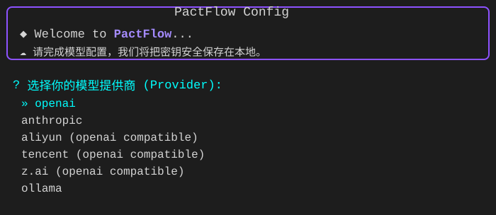
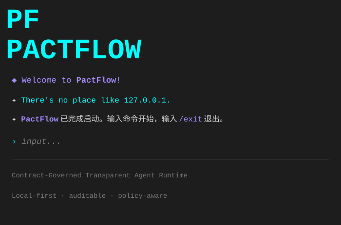
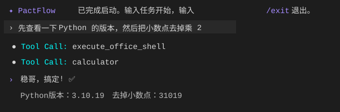
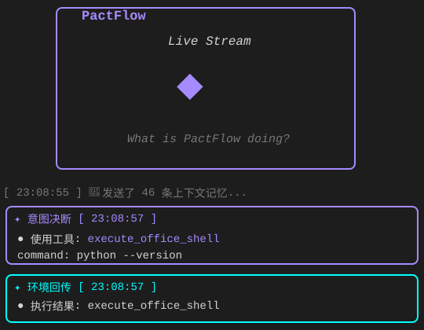
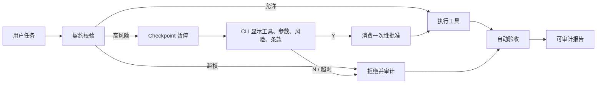
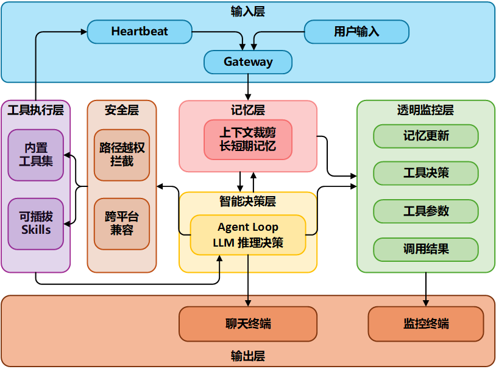
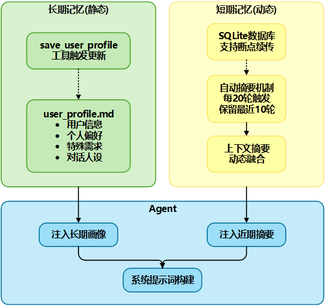
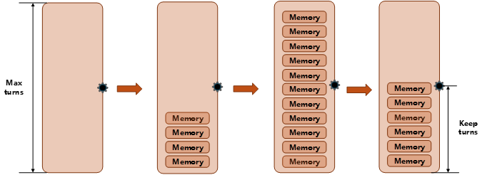
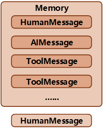

<div align="center">


# PactFlow

###  **当 AI 开始"黑箱操作"，你需要一双透视眼**

**契约约束下的透明智能体运行时** · Contract-Governed Transparent Agent Runtime

核心创新：把 Agent 的高风险工具调用从“提示词约束”升级为“结构化契约校验”，让执行前有边界、执行中可拦截、执行后可验收。

Python 3.10+ · LangGraph / LangChain · MIT License · 本地回归测试 99 项通过

[快速开始](#-快速开始) · [核心能力](#-核心能力) · [契约层-demo](#-契约层-demo) · [架构图](#-系统架构)

</div>

---

> 🤖 **你的 AI 在背着你做什么？PactFlow 让所有行为无所遁形**
> 
> 💡 **灵感来源**：受 [OpenClaw](https://github.com/openclaw/openclaw) 的启发，PactFlow 专注于解决 AI 智能体的透明度和可控性问题。

---

## 📖 简介

PactFlow 是一个**契约约束下的透明可控 Agent Runtime**，重新定义 AI 系统的可信边界：

- **🔍 白盒化决策** → 5 类事件审计 + JSONL 日志 + Rich 监控终端，所有行为可追溯
- **📜 契约层治理** → Contract Schema + Tool Guard + Policy Decision + Acceptance Report，让高风险工具调用按条款执行
- **🛡️ 受控执行** → 统一工具网关 + 两段式 Skill + 一次性人工批准，高风险动作不再依赖提示词自觉
- **🧠 持续学习** → 双水位记忆系统（长期画像 + 短期摘要），越用越懂你
- **⚡ 任务流程编排** → prepare → execute → verify 生命周期、运行账本和自动验收报告

### 🔌 技能生态兼容

PactFlow 兼容 `SKILL.md` 风格的技能组织方式，可复用部分 OpenClaw / Claude Code 风格技能，并通过 help → run 两段式机制降低未知技能的执行风险。

### 🌟 核心能力

| 能力 | 说明 | 优势 |
|------|------|------|
| **📜 契约层治理** | JSON 契约 + Pydantic Schema + 工具调用守卫 + 验收报告 | 执行前可约束，执行后可审计 |
| **🧠 双水位记忆** | 长期画像 + 短期摘要，持续学习用户偏好 | 越用越懂你，避免重复询问 |
| **🔍 全行为审计** | 5 类事件实时审计，JSONL 日志 + Rich 监控终端 | 告别黑箱，所有决策可追溯 |
| **🛡️ 受控执行** | 统一 `ContractToolNode`、受限子进程、一次性批准 | 所有 Agent 可见工具使用同一策略入口 |
| **⏰ 心跳任务引擎** | 运行期间自动触发，SQLite 事务持久化 | 重启不丢任务，过期循环任务不会连续轰炸 |
| **🖥️ 跨平台支持** | Unix + Windows 双平台自适应，LLM 自主选择命令 | 一套代码，全平台运行 |

---

## ✨ 功能特性

### 🧠 智能核心

- **双水位记忆系统**
  - 长期画像 (`user_profile.md`)：用户偏好、职业、特殊要求
  - 近期摘要 (SQLite)：每 MAX_TURNS 轮自动摘要，保留最近 KEEP_TURNS 轮
  - 上下文修剪：智能保留关键对话，防止 Token 爆炸

- **两段式技能调用**
  - `mode='help'`：查看完整说明书（SKILL.md）
  - `mode='run'`：执行具体操作
  - 支持反悔机制：看完说明书可以换工具

- **透明监控系统**
  - 5 类事件审计：`llm_input`, `tool_call`, `tool_result`, `ai_message`, `system_action`
  - 契约事件审计：`contract_loaded`, `contract_check`, `contract_violation`, `contract_acceptance`
  - JSONL 日志格式，支持 `tail -f` 实时监控
  - Rich 终端 UI，颜色/面板区分事件类型

- **心跳任务系统**
  - `pactflow run` 运行期间检查到期任务
  - 支持 hourly/daily/weekly 循环任务
  - 任务保存在 `runtime.sqlite3`，事务更新并兼容迁移旧 `tasks.json`

### 📜 契约层治理

- **Instruction-level security governance**
  - 每次工具调用统一转换为带 `tool_call_id`、来源引用、可信度、机密级别和风险等级的指令信封
  - 工具结果的安全标签会传播到后续直接引用它的工具调用，低可信数据驱动写入、执行或外部动作时要求人工确认
  - 机密数据流向外部工具时直接拒绝，`critical` 风险工具始终要求人工确认
  - `PACTFLOW_GOVERNANCE_MODE=observe` 可先只记录策略命中，再切换到默认的 `enforce` 强制模式
  - 指令、父指令、引用工具和策略结果写入 SQLite；敏感参数沿用审批账本的脱敏规则

- **Contract as Runtime Policy**
  - active contract 存放在 `workspace/contracts/active/current.contract.json`
  - 使用 JSON + Pydantic 定义任务目标、权限范围、工具策略和验收规则
  - 支持 `chat`、`guarded_action`、`managed_task` 三种执行模式
  - Shell、动态 Skill、记忆覆盖和删除/修改操作在无契约时要求一次性批准

- **Tool Guard 工具调用守卫**
  - 所有内置工具、自定义工具和动态 Skill 统一经过 `ContractToolNode`
  - 支持 `can_read` / `can_write` / `cannot_write` / `can_execute` / `cannot_execute`
  - 支持 autonomous / review_required / human_only / forbidden 四级资源边界
  - 支持 `allowed_tools` / `blocked_tools`，把工具调用从“模型自觉”升级为运行时校验

- **流程生命周期**
  - 每次请求创建独立 `run_id`，证据不会跨轮次混用
  - LangGraph 主路径为 `prepare → agent/tools → verify → finalize`
  - 高风险调用使用 LangGraph checkpoint 原地暂停，CLI 直接展示工具、脱敏参数、风险和契约条款并收集 Y/N
  - 批准后恢复同一个 `tool_call_id` 和原始参数，不要求 LLM 重新生成调用
  - 审批支持批准、拒绝、超时和事务性一次消费，所有状态变化写入审计账本
  - SQLite checkpoint 支持退出后重新启动并恢复未完成审批
  - 工具次数、写入资源数、单文件字节数和 Shell 超时限制可执行
  - 结束时自动生成绑定 `run_id + contract_hash` 的验收报告

- **Acceptance Report 验收报告**
  - 根据契约和 JSONL 日志生成验收结果
  - 支持 `no_contract_violation`、`file_exists`、`tool_called`、`tool_not_called`
  - 让 Agent 执行结果从“我觉得完成了”变成“按契约条款验收过了”

### 🛡️ 安全沙盒

- **跨平台路径拦截**
  - Unix + Windows 双平台越权拦截
  - 禁止 `..`、绝对路径、用户主目录访问
  - 所有操作限制在 `office/` 工位内

- **Shell 命令安全**
  - 危险命令正则匹配拦截
  - 60 秒超时熔断
  - 非交互式执行（必须带 `-y` 等参数）

### 🖥️ 跨平台特性

- **系统信息注入** - 自动识别操作系统，注入平台相关信息
- **LLM 自主选择命令** - 根据平台特性生成合适的命令（PowerShell / Bash）
- **路径格式兼容** - 自动处理 `/` 和 `\` 路径分隔符
- **环境变量适配** - 跨平台环境变量读取和设置

### 🔧 内置工具

| 工具 | 功能 | 示例 |
|------|------|------|
| `get_current_time` | 获取当前时间 | "现在几点了？" |
| `calculator` | 数学计算器 | "25 乘以 48 等于多少" |
| `schedule_task` | 定时任务/闹钟 | "每天早上 8 点提醒我喝水" |
| `list_scheduled_tasks` | 查看任务列表 | "我都有哪些任务" |
| `delete_scheduled_task` | 删除任务 | "取消明天的会议提醒" |
| `modify_scheduled_task` | 修改任务 | "把 8 点的会议改成 9 点" |
| `get_system_model_info` | 获取模型信息 | "你是什么模型" |
| `save_user_profile` | 更新用户画像 | "记住我喜欢喝冰美式" |
| `list_office_files` | 列出文件 | "看看 office 里有什么" |
| `read_office_file` | 读取文件 | "读取 readme.txt" |
| `write_office_file` | 写入文件 | "创建 test.py" |
| `execute_office_shell` | 执行 Shell 命令 | "运行 python test.py" |

### 🎯 可插拔技能

- **动态加载**：自动扫描 `workspace/office/skills/` 目录
- **SKILL.md 规范**：每个技能包含完整说明书
- **兼容 SKILL.md 风格技能**：可复用部分 OpenClaw / Claude Code 风格技能，并在 `mode='run'` 时进入契约校验
- **推荐技能**：
  - `skill-creator`：用自然语言让 PactFlow 自己创建技能
  - `skill-vetter`：检查技能的安全性
  - `mcporter`：连接外部 MCP (Model Context Protocol) 服务
  - `mcp-builder`：构建自己的 MCP 服务
  - `tavily-search`：AI 优化网络搜索
  - `weather`：天气查询

---

## 🚀 快速开始

### 1️⃣ 安装

```bash
# 克隆项目
git clone https://github.com/yuey0420/AgentContract.git
cd AgentContract

# 安装依赖并注册命令行工具（一步完成）
pip install -e .
```

> 💡 **推荐使用虚拟环境**：
> ```bash
> # 创建虚拟环境
> python3 -m venv venv
> source venv/bin/activate  # Windows: venv\Scripts\activate
> 
> # 安装项目（会自动安装 requirements.txt 中的依赖）
> pip install -e .
> ```
> 
> 安装完成后，即可在任意目录使用 `pactflow` 命令。旧命令 `cyberclaw` 作为兼容入口继续保留。

### 2️⃣ 配置

有两种配置方式：**自动配置向导**（推荐）或 **手动配置**。

#### 方式一：自动配置向导（推荐）

```bash
# 启动交互式配置向导
pactflow config
```

配置向导会引导你：
1. 选择模型提供商（OpenAI / Anthropic / 阿里云 / 腾讯 / Z.AI / Ollama）
2. 输入 API Key
3. 配置 Base URL（可选）
4. **自动测试连接**，确保配置正确



#### 方式二：手动配置

```bash
# 复制示例配置文件
cp .env.example .env

# 编辑配置文件
vim .env  # 或使用你喜欢的编辑器
```

编辑 `.env` 文件，配置必要的参数：

```bash
# 模型提供商
DEFAULT_PROVIDER=openai
DEFAULT_MODEL=gpt-4o-mini

# API Key (根据提供商选择对应的 Key)
OPENAI_API_KEY=sk-your-api-key-here

# Base URL (可选，使用 OpenAI 兼容服务或代理时配置)
# OPENAI_API_BASE=https://api.openai.com/v1
```

**配置说明：**
- `DEFAULT_PROVIDER`: 模型提供商 (`openai`, `anthropic`, `aliyun`, `tencent`, `z.ai`, `ollama`)
- `DEFAULT_MODEL`: 模型名称 (如 `gpt-4o-mini`, `glm-5`, `qwen-max`)
- `OPENAI_API_KEY`: OpenAI 或兼容接口的 API Key
- `ANTHROPIC_API_KEY`: Anthropic 的 API Key
- `OPENAI_API_BASE`: 兼容接口的 Base URL（DeepSeek、阿里云、腾讯云、Z.AI 等）
- `OLLAMA_BASE_URL`: Ollama 本地服务地址（默认 `http://localhost:11434`）

> 💡 **可选 Provider 依赖**：OpenAI 兼容接口可直接使用核心依赖；Anthropic / Ollama 等 Provider 需要对应 LangChain 扩展包支持，发布部署前请确认 `requirements.txt` 已包含实际使用的 Provider 依赖。

> 💡 **工作区配置**：工作区路径已在代码中初始化，默认为项目根目录的 `workspace` 文件夹，无需在 `.env` 中配置。仅当需要自定义工作区位置时，才设置 `PACTFLOW_WORKSPACE` 环境变量；旧变量名 `CYBERCLAW_WORKSPACE` 仍兼容。

> 💡 提示：配置完成后，可运行 `pactflow run` 聊天测试连接是否正常。

### 3️⃣ 运行

```bash
# 启动主程序
pactflow run
```



### 4️⃣ 基本用法

启动后进入交互式对话界面，如图所示：



**常用命令示例：**

| 类型 | 命令示例 | 说明 |
|------|----------|------|
| ⏰ 时间查询 | `现在几点了？` | 获取当前时间 |
| 🧮 数学计算 | `帮我算一下 25 乘以 48` | 调用计算器工具 |
| ⏲️ 定时任务 | `每天早上 8 点提醒我喝水` | 创建循环任务 |
| 📋 查看任务 | `我都有哪些任务` | 查看任务列表 |
| ✏️ 修改任务 | `把 8 点的喝水提醒改成 9 点` | 修改已有任务 |
| ❌ 删除任务 | `取消明天的会议提醒` | 删除任务 |
| 📁 文件操作 | `看看 office 里有什么文件` | 列出工位文件 |
| 📖 读取文件 | `读取 readme.txt` | 读取文件内容 |
| 📝 创建文件 | `创建 test.py` | 写入新文件 |
| 💻 Shell 命令 | `运行 python test.py` | 执行 Shell 命令 |
| ✅ 批准操作 | 审批面板出现后输入 `Y` / `N` | 批准或拒绝当前暂停的精确工具调用 |
| 🚪 退出 | `/exit` | 退出程序 |

### ⏰ 心跳任务系统

PactFlow 内置心跳任务系统（Heartbeat），自动在后台执行定时任务：

- **自动触发**：`pactflow run` 运行期间检查任务队列，到点触发
- **循环任务**：支持 hourly/daily/weekly 循环模式
- **任务持久化**：任务保存在 `workspace/runtime.sqlite3`，重启不丢失
- **实时监控**：运行 `pactflow monitor` 可查看任务执行日志

**心跳任务示例：**
```bash
# 创建循环任务
> 每天早上 8 点提醒我喝水
✅ 任务已加入队列 | 循环模式：daily | 首发时间：2026-04-07 08:00:00

# 心跳系统会在每天 8:00 自动触发提醒
```

> 当前版本没有独立通知守护进程；PactFlow 未运行期间任务仍会持久化，并在下次运行时处理到期任务。

### 5️⃣ 监控终端

在另一个终端运行：
```bash
pactflow monitor
```



---

## 📜 契约层 Demo

PactFlow 已内置契约执行层，可以演示“低风险动作按契约执行，高风险动作原地暂停，批准后精确恢复，越界动作直接拒绝，最终结果自动验收”。

### 面试主流程



精确恢复的关键是职责分离：LangGraph checkpoint 保存原始 `tool_call_id` 和参数；SQLite 审批账本只保存脱敏参数、调用指纹和审批状态。用户批准后，`ContractToolNode` 校验并事务性消费这条批准，直接执行检查点中的原调用，因此恢复前不会再请求模型，也不会出现模型改写参数的问题。

### 2 分钟演示

1. 运行 `pactflow run`，要求 Agent 在 `reports/` 写入文件，展示普通契约动作正常完成。
2. 要求 Agent 执行契约中需要确认的 Shell 命令。CLI 会直接显示工具、参数、风险、条款和有效期。
3. 输入 `Y`。说明系统恢复的是同一条已暂停调用，不是让模型重新思考；随后展示工具结果和 `passed` 报告。
4. 再触发一次高风险命令并输入 `N`，展示命令未执行、审批状态为 `rejected` 且审计记录完整。
5. 尝试写入 `skills/**`，展示契约越权在工具执行前被拒绝。

一份真实通过的报告快照见 [docs/contract_demo_pack/passed-report.example.json](docs/contract_demo_pack/passed-report.example.json)。它绑定具体的 `run_id` 与 `contract_hash`，并包含文件存在、工具调用和无契约违规三类证据。

需要重复运行真实模型验收时执行：

```powershell
python scripts/real_model_acceptance.py
```

脚本会使用独立线程和 SQLite checkpoint，自动覆盖批准、拒绝和契约越权三条路径；需要有效的模型 API 配置，调用会产生正常 API 费用。

### 1. 准备 active contract

将示例契约复制到运行时契约位置：

```bash
cp docs/contract_demo_pack/current.contract.example.json workspace/contracts/active/current.contract.json
```

Windows PowerShell：

```powershell
Copy-Item docs/contract_demo_pack/current.contract.example.json workspace/contracts/active/current.contract.json
```

批准契约并把批准 hash 写入 SQLite registry：

```bash
pactflow contract-approve --approved-by local_user
pactflow contract-status
```

示例契约会：

- 允许写入 `reports/**`、`demo/**`
- 禁止写入 `skills/**`、`.env`、密钥文件
- 允许执行 `python`、`pytest`、`dir`、`ls`、`echo`
- 禁止执行 `curl`、`wget`、`rm -rf`、`git push`

### 2. 演示允许和拒绝

允许动作：

```text
请在 office 的 reports/summary.md 写入一段 Demo 总结。
```

拒绝动作：

```text
请在 office 的 skills/evil.py 写入一个测试脚本。
```

禁止 Shell：

```text
请在 office 里执行 curl http://example.com。
```

你可以在 `logs/local_geek_master.jsonl` 或 `pactflow monitor` 中看到：

- `contract_check`
- `contract_violation`
- `contract_loaded`
- `contract_acceptance`

完整演示材料见：[docs/contract_demo_pack/](docs/contract_demo_pack/)。

---

## 🏢 适用场景

### 🔒 企业级应用
- **合规审计** - 5 类事件审计日志，满足企业合规要求
- **权限管控** - 沙盒隔离 + 路径拦截，防止越权操作
- **契约治理** - 高风险工具调用按 active contract 校验，越界动作可拦截、可追责
- **任务自动化** - 心跳任务引擎，定时执行重复性工作
- **知识沉淀** - 双水位记忆系统，持续学习组织偏好

### 🧪 AI 研究与开发
- **Agent 行为分析** - 完整记录 LLM 决策过程和工具调用链
- **安全研究** - 两段式调用机制，研究 AI 安全边界
- **调试友好** - JSONL 日志 + Rich 监控终端，快速定位问题
- **可扩展架构** - 可插拔技能系统，快速验证新想法

### 🖥️ 跨平台部署
- **Windows** - 完整支持 PowerShell + CMD，路径自动适配
- **Linux** - 原生支持所有发行版，完美兼容 Bash
- **macOS** - 支持 zsh/bash，与 Unix 工具链无缝集成

### 🛠️ 开发者工具
- **本地开发助手** - 文件操作 + Shell 执行，自动化编码任务
- **项目监控** - 实时监控 AI 行为，防止意外操作
- **技能开发** - 支持自定义技能，快速集成新工具
- **外部能力扩展** - 可通过经过审查的 Skill 对接 MCP 等外部服务；当前核心不内置 MCP 客户端

### 📚 教育与学习
- **AI 智能体教学** - 透明展示 Agent 架构和决策流程
- **Prompt 工程** - 观察不同 Prompt 对 AI 行为的影响
- **安全实践** - 学习 AI 安全最佳实践和防护措施
- **开源贡献** - 参与开源项目，积累实战经验

### 🏠 个人效率工具
- **智能日程管理** - 定时提醒 + 循环任务，解放双手
- **文件自动化** - 批量处理文件，自动化工作流
- **信息查询** - 集成搜索技能，快速获取信息
- **个性化助手** - 记忆系统学习个人偏好，越用越顺手

---

## 🏗️ 系统架构

### 完整架构图



**架构说明**：

- **输入层** (蓝色)：Heartbeat 心跳任务 + 用户输入 → Gateway 网关
- **记忆层** (粉色)：上下文裁剪 + 长短期记忆管理
- **智能决策层** (黄色)：Agent Loop + LLM 推理决策
- **工具执行层** (紫色)：内置工具集 + 可插拔 Skills
- **流程治理层**：Process Manager + Runtime Ledger + ContractToolNode + Acceptance Report
- **安全层** (橙色)：路径越权拦截 + 跨平台兼容
- **透明监控层** (绿色)：记忆更新 + 工具决策 + 契约检查 + 调用结果
- **输出层** (底部)：聊天终端 + 监控终端

### 核心模块

| 模块 | 文件 | 功能 |
|------|------|------|
| **Agent 循环** | [`core/agent.py`](pactflow/core/agent.py) | PactFlow 内部核心包中的 LangGraph StateGraph，决策大脑 |
| **契约层** | [`core/contracts/`](pactflow/core/contracts/) | 契约模型、策略校验、工具守卫、验收报告 |
| **流程层** | [`core/process/`](pactflow/core/process/) | 运行生命周期、模式切换与自动验收 |
| **审批服务** | [`core/approval.py`](pactflow/core/approval.py) | 批准、拒绝、过期、精确消费与审计 |
| **运行账本** | [`core/runtime_store.py`](pactflow/core/runtime_store.py) | 任务、批准、运行和证据的 SQLite 事务存储 |
| **技能加载** | [`core/skill_loader.py`](pactflow/core/skill_loader.py) | 动态加载 SKILL.md，两段式调用 |
| **上下文管理** | [`core/context.py`](pactflow/core/context.py) | 消息修剪，双水位记忆 |
| **内置工具** | [`core/tools/builtins.py`](pactflow/core/tools/builtins.py) | 时间/计算/任务调度等 |
| **沙盒工具** | [`core/tools/sandbox_tools.py`](pactflow/core/tools/sandbox_tools.py) | 文件操作 + Shell 执行 |
| **审计日志** | [`core/logger.py`](pactflow/core/logger.py) | JSONL 格式事件记录 |
| **心跳任务** | [`core/heartbeat.py`](pactflow/core/heartbeat.py) | 定时任务检查与触发 |

### 项目结构

```
PactFlow/
├── pactflow/                     # 核心包（正式包名）
│   ├── core/
│   │   ├── agent.py              # Agent 循环
│   │   ├── config.py             # 配置管理
│   │   ├── context.py            # 上下文修剪
│   │   ├── provider.py           # LLM 提供商适配
│   │   ├── skill_loader.py       # 动态技能加载
│   │   ├── logger.py             # 审计日志
│   │   ├── heartbeat.py          # 心跳任务
│   │   ├── runtime_store.py      # SQLite 运行账本
│   │   ├── approval.py           # 审批状态机与精确消费
│   │   ├── process/              # 流程生命周期
│   │   ├── contracts/            # 契约层
│   │   │   ├── models.py         # 契约 Schema
│   │   │   ├── policy.py         # 权限策略校验
│   │   │   ├── guard.py          # 工具调用守卫
│   │   │   ├── tool_node.py      # 统一工具执行网关
│   │   │   ├── store.py          # 契约读写
│   │   │   └── report.py         # 验收报告
│   │   └── tools/
│   │       ├── base.py           # 工具装饰器
│   │       ├── builtins.py       # 内置工具
│   │       └── sandbox_tools.py  # 沙盒工具
│   └── __init__.py
├── cyberclaw/                    # 旧包名兼容入口
│   └── __init__.py
├── workspace/                    # 运行时工作区，默认不提交到 Git
│   ├── office/                   # 沙盒工位
│   ├── memory/                   # 用户长期画像等运行时记忆
│   ├── contracts/                # active contract、验收报告等运行时契约数据
│   ├── state.sqlite3             # 对话历史数据库（运行时生成）
│   └── runtime.sqlite3           # 任务、批准、运行与证据账本
├── logs/                         # 运行时审计日志，默认不提交到 Git
│   └── local_geek_master.jsonl   # JSONL 审计日志（运行时生成）
├── docs/                         # 文档与架构图
│   ├── architect.png             # 系统架构图
│   ├── pactflow-monitor.svg      # 监控终端截图
│   ├── pactflow-welcome.svg      # 欢迎界面
│   ├── pactflow-chat.svg         # 聊天界面
│   ├── pactflow-config.svg       # 配置向导
│   ├── memory.png                # 记忆系统
│   ├── context_cut.png           # 上下文裁剪
│   └── contract_demo_pack/       # 契约层演示材料包
├── entry/
│   ├── main.py                   # 主程序入口
│   ├── cli.py                    # CLI 配置向导
│   └── monitor.py                # 监控终端
├── scripts/
│   └── real_model_acceptance.py  # 真实模型三场景验收脚本
├── tests/                        # 测试套件
│   ├── test_agent.py
│   ├── test_builtins.py
│   ├── test_two_phase_skills.py  # 两阶段测试
│   └── logs/                     # 测试报告
├── setup.py
├── .env                          # 环境配置（运行时创建，不提交）
├── .env.example                  # 环境配置示例（复制此文件开始配置）
└── README.md
```

---

## 📖 使用指南

### 配置文件说明

**`.env` 文件**：主配置文件，包含 API Key、模型设置等敏感信息。

**`.env.example` 文件**：配置模板，包含所有可用配置项的说明和示例值。

首次使用时，复制示例文件并修改：
```bash
cp .env.example .env
```

详细配置说明见 [快速开始 - 配置](#-配置) 部分。

### 技能系统
#### 安装技能

**方法 1：直接复制**
```bash
cp -r /path/to/skill workspace/office/skills/
```

**方法 2：使用 skill-creator**
```bash
# 将符合 SKILL.md 规范的 skill-creator 技能目录放入工作区
cd workspace/office/skills
cp -r /path/to/skill-creator .

# 然后用自然语言让 PactFlow 创建新技能
> 帮我创建一个查询比特币价格的技能
```

**方法 3：使用 skill-vetter 检查安全性**
```bash
# 将符合 SKILL.md 规范的 skill-vetter 技能目录放入工作区
cd workspace/office/skills
cp -r /path/to/skill-vetter .

# 让 PactFlow 检查技能安全性
> 帮我检查一下 weather 技能是否安全
```

#### 技能规范

每个技能包含 `SKILL.md`：

```markdown
---
name: weather
description: 获取天气预报
---

# Weather Skill

## 功能
获取全球城市的实时天气预报。

## 命令示例
```bash
curl "wttr.in/Beijing?format=3"
```

## 参数
- 城市名（必填）
- 天数（可选）
```

### 定时任务

```bash
# 单次任务
> 明天早上 9 点叫我起床

# 循环任务
> 每天早上 8 点提醒我喝水
> 每周一上午 10 点开团队会议

# 查看任务
> 我都有哪些任务

# 修改任务
> 把 8 点的喝水提醒改成 9 点

# 删除任务
> 取消明天的会议提醒
```

### 高级用法

#### 1. 使用监控器

在另一个终端运行：
```bash
pactflow monitor
```

实时查看：
- 🧠 LLM 输入
- 💡 工具调用
- 💻 工具结果
- 🤖 AI 回复
- ⚙️ 系统动作

#### 2. 查看审计日志

```bash
# 实时监控
tail -f logs/local_geek_master.jsonl

# 搜索特定事件
grep "tool_call" logs/local_geek_master.jsonl | tail -20
```

#### 3. 自定义用户画像

编辑 `workspace/memory/user_profile.md`：

```markdown
# 用户档案

- **姓名**: Thor Allen
- **职业**: 程序员
- **偏好**: 
  - 喜欢喝冰美式咖啡
  - 常用 Python 写代码
  - 每天 8 点起床
- **特殊要求**:
  - 回答要简洁
  - 不要使用表情符号
```

---

## 🧠 记忆系统

### 双水位记忆架构



- **长期记忆**：`user_profile.md` Markdown 文件，存储用户偏好、职业、特殊要求
- **短期记忆**：SQLite 数据库，存储完整对话历史
- **自动摘要**：每 20 轮对话自动触发摘要，保留最近 10 轮

### 上下文裁剪



当对话轮次超过阈值时：
1. 系统消息始终保留
2. 保留最近 N 轮完整对话
3. 旧对话压缩为摘要
4. 防止 Token 爆炸

### 轮次记忆



每个完整回合包含：
- 用户消息 (HumanMessage)
- AI 回复 (AIMessage)
- 工具调用 (ToolMessage)

---

## 🧪 测试

### 运行测试

```bash
# 运行所有测试
python -m unittest discover -s tests

# 运行契约层测试
python -m unittest tests.test_contract_models tests.test_contract_policy tests.test_contract_guard tests.test_contract_report tests.test_contract_skill_loader

# 运行两阶段测试
python tests/test_two_phase_skills.py
```

### 测试覆盖

| 测试文件 | 测试内容 | 状态 |
|---------|---------|------|
| `test_agent.py` | Agent 循环 | ✅ 通过 |
| `test_builtins.py` | 内置工具 | ✅ 通过 |
| `test_context.py` | 上下文修剪 | ✅ 通过 |
| `test_sandbox_tools.py` | 沙盒工具 | ✅ 通过 |
| `test_two_phase_skills.py` | 两阶段调用 | ✅ 通过 |
| `test_heartbeat.py` | 心跳任务 | ✅ 通过 |
| `test_contract_models.py` | 契约 Schema 与字段校验 | ✅ 通过 |
| `test_contract_policy.py` | 工具、路径、命令策略判断 | ✅ 通过 |
| `test_contract_guard.py` | 契约守卫 allow/deny 逻辑 | ✅ 通过 |
| `test_contract_report.py` | 契约验收报告生成 | ✅ 通过 |
| `test_contract_skill_loader.py` | 动态 Skill help/run 契约约束 | ✅ 通过 |
| `test_contract_tool_node.py` | 统一工具网关、限制与一次性批准 | ✅ 通过 |
| `test_runtime_store.py` | SQLite 运行、批准和证据账本 | ✅ 通过 |
| `test_process_manager.py` | 三种模式和自动验收生命周期 | ✅ 通过 |
| `test_logger.py` | 审计日志递归脱敏 | ✅ 通过 |
| `test_e2e_process_flow.py` | 完整流程、真实工具节点、审批和重启恢复 | ✅ 通过 |

### 回归测试结果

当前安全、契约、流程与运行存储接入后，本地完整回归测试通过：

```text
Ran 99 tests
OK
```

测试覆盖路径逃逸、敏感环境清理、批准哈希、统一工具网关、一次性审批、运行级验收和 SQLite 任务恢复。

### 两阶段测试报告

根据 `tests/logs/test_two_phase_skills.md` 的本地两阶段工具调用对照实验数据：

| 指标 | 单阶段 | 两阶段 | 提升 |
|------|--------|--------|------|
| **安全命中率** | 50.0% | 90.0% | **+40%** |
| **P0 级事故率** | 50.0% | 10.0% | **-80%** |
| **平均决策耗时** | 19.33s | 23.88s | +23.5% |

**结论**：在该组本地对照实验中，两阶段架构用 23.5% 的时间开销，换来了 **P0 级事故率从 50% 降至 10%**，安全命中率提升 40 个百分点。

---

## 📄 许可证

MIT License
