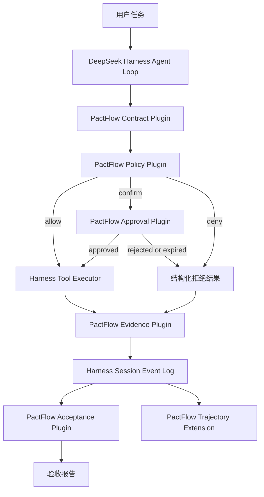

# PactFlow 基于 DeepSeek Harness 的插件化迁移方案

## 文档决定

PactFlow 后续采用 DeepSeek Harness 作为通用 Agent 运行时。PactFlow 现有创新收敛为一组治理插件，继续负责契约、策略判断、人工批准、证据和验收。

现有 Python 项目进入参考实现阶段。它承担行为规范、回归样例和迁移对照，不再同时建设另一套完整的 Session、Agent Loop、Trajectory、Provider 和前端体系。

迁移采用插件优先、少量上游补点、避免长期重度分叉的方式。第一阶段只做一条完整流程。原型通过后再迁移其余能力。

## 选择这条路线的依据

DeepSeek Harness 已经覆盖了 PactFlow 后续必然要面对的大量通用问题，包括事件溯源会话、工具生命周期、崩溃修复、模型适配、长会话处理、客户端扩展和轨迹界面。

PactFlow 当前最有辨识度的能力集中在执行治理领域。现有代码中的 Contract Schema、Instruction lineage、一次性批准、文件基线、证据分级、变更对账和自动验收可以形成独立产品层。这些能力与 Harness 的工具中间件、Session Event、命令系统和客户端插槽能够对应。

继续扩建独立运行时会长期消耗在基础设施补课上。采用 Harness 后，主要开发时间可以回到 PactFlow 真正需要负责的治理语义。

## 产品定位

迁移后的 PactFlow 定位为 DeepSeek Harness 的契约治理与可验证执行套件。

它向运行时提供以下能力。

- 读取、校验和激活任务契约
- 在工具执行前完成权限、范围、数据流和风险判断
- 对需要确认的动作发起一次性批准
- 记录调用、策略、批准、结果和证据之间的关联
- 对文件系统和仓库变更进行基线对账
- 按契约生成机器可读的验收报告
- 在 Trajectory 中显示治理过程和验收结论

## 职责边界

| 领域 | DeepSeek Harness 负责 | PactFlow 负责 |
|---|---|---|
| 会话 | Session Event、持久化、恢复、回放 | 契约事件和证据事件扩展 |
| Agent 执行 | Agent Loop、模型请求、工具协议、取消与重试 | 工具执行前的治理判断 |
| 模型接入 | Provider、流式响应、请求生命周期 | 记录契约相关的请求配置摘要 |
| 工具 | 注册、调度、结果回传、嵌套调用 | 能力分类、资源解析、策略拦截 |
| 人机交互 | 通用询问、批准界面和客户端通道 | 批准内容、期限、绑定关系和消费规则 |
| 轨迹 | 原始事件、Trajectory 组装和展示框架 | 策略、证据、验收的专属记录与详情视图 |
| 报告 | Session 查询和导出能力 | Contract Acceptance Report |

## 目标架构



Harness Session Event Log 是执行事实的统一来源。PactFlow 插件只能基于已记录事实生成策略视图、证据视图和验收报告。JSONL 可以作为导出格式保留，不能继续承担独立事实源的职责。

## 插件拆分

### pactflow-contract

负责契约模型、版本、哈希、加载、激活和生命周期。契约继续采用语言无关的 JSON 格式。TypeScript 版本必须读取现有 Python 版本生成的契约，并产生相同的规范化结果和哈希。

主要输出包括 `contract/activated`、`contract/rejected` 和 `contract/closed` 事件。

### pactflow-policy

挂接 Harness 的工具执行中间件。每次调用进入工具实现前，插件根据工具、参数、资源、契约和数据来源生成结构化决定。

决定只允许 `allow`、`deny` 和 `confirm`。策略异常、契约解析失败和关键上下文缺失时按拒绝处理。

主要输出包括 `policy/evaluated` 事件。事件保存契约哈希、工具调用 ID、规则编号、资源、风险等级和决定，不保存无控制的敏感明文。

### pactflow-approval

负责 `confirm` 决定的后续流程。批准必须绑定 Session、工具调用 ID、契约哈希和参数指纹。批准只能消费一次，过期、拒绝和参数变化都会使它失效。

Harness 恢复执行时必须继续使用原工具调用，不能重新请求模型生成参数。

主要输出包括 `approval/requested`、`approval/approved`、`approval/rejected`、`approval/expired` 和 `approval/consumed` 事件。

### pactflow-evidence

负责文件基线、命令结果摘要、资源变化、工具结果可信度和证据等级。大体积内容写入独立对象存储或文件存储，Session Event 只保存引用、哈希、长度和访问级别。

工具开始执行前必须先让 `tool/start` 到达持久化检查点。进程恢复时发现已有 `tool/start` 且没有终态事件，应记录 `tool/outcome-unknown`。这类动作不能自动重试，除非工具声明为只读或幂等，并且恢复策略允许。

### pactflow-acceptance

读取契约和 Session Event，运行验收规则并生成稳定结果。报告必须绑定 Session ID、契约哈希、规则版本和事件范围。

验收函数保持确定性。同一组事件和同一份契约必须得到相同结果。需要读取当前外部状态的规则必须显式记录采样时间和证据来源。

### pactflow-ui

向 Harness Trajectory 注册 PactFlow 专属记录。主列表只显示决策、工具、资源、状态和耗时。完整参数、证据、条款和验收详情放在检查面板中。

界面使用 Harness 已有的 Session 分页、稳定记录 ID 和详情区域，不再建设独立轨迹数据源。

## 建议目录

```text
packages/
  pactflow-contract/
  pactflow-policy/
  pactflow-approval/
  pactflow-evidence/
  pactflow-acceptance/
  pactflow-ui/
  pactflow-testkit/
schemas/
  contract.schema.json
  acceptance-report.schema.json
fixtures/
  contracts/
  trajectories/
  reports/
```

`pactflow-testkit` 保存跨语言夹具。Python 和 TypeScript 对同一输入必须产生相同契约哈希、策略决定和验收结论。

## 事件约定

所有 PactFlow 事件使用版本化、可验证的 JSON 数据。每个业务对象必须有稳定 ID，禁止依靠事件位置或显示文本进行关联。

建议保留以下关联字段。

```json
{
  "schemaVersion": 1,
  "contractId": "contract-id",
  "contractHash": "sha256:...",
  "toolCallId": "call-id",
  "instructionId": "instruction-id",
  "parentInstructionId": null,
  "sourceEventSeqs": [],
  "decision": "allow",
  "resource": "reports/result.md",
  "riskLevel": "medium"
}
```

事件写入时必须拒绝无法无损序列化的数据。不能使用类似 `default=str` 的兜底方式静默改变类型。

## 八周实施计划

### 第零阶段 迁移准备

时间为三个工作日。

- 冻结 Python 版 Contract Schema 和 Acceptance Report Schema
- 从现有测试提取十到二十个跨语言夹具
- 固定一个 Harness commit 作为原型基线
- 核对 Harness 许可证、插件分发方式和商用部署条件
- 建立插件仓库和兼容性测试任务
- 列出需要验证的 Harness 扩展点

完成标志是 TypeScript 能读取现有契约并得到与 Python 相同的规范化哈希。

### 第一阶段 纵向原型

时间为两周。这一阶段决定整个迁移是否继续。

原型只支持一个文件写入工具、一条路径规则和一次人工批准。完整流程必须覆盖允许、拒绝、批准、过期和崩溃恢复。

必须交付以下结果。

- 工具执行前完成策略检查
- 拒绝动作没有进入工具实现
- 批准后继续执行原调用
- `tool/start` 在副作用发生前持久化
- 崩溃后能够识别未知结果
- Session Event 能生成一份确定性验收报告
- Trajectory 能显示策略和批准记录

### 第二阶段 治理能力迁移

时间为三周。

- 迁移工具能力和资源分类
- 迁移 Instruction lineage 与引用关系
- 迁移信任等级和机密等级传播
- 迁移一次性批准状态机
- 迁移基线、checkpoint 和文件变更对账
- 迁移现有验收规则

这一阶段结束后，Python 版停止接收新的治理功能。缺陷修复只服务于夹具生成和行为对照。

### 第三阶段 产品接入

时间为两周。

- 完成 Trajectory 详情视图
- 增加契约激活、状态查询和报告导出命令
- 编写从 Python PactFlow 迁移配置和契约的说明
- 建立 Harness 升级兼容测试
- 用真实任务完成端到端验证

## 继续迁移的硬门槛

纵向原型同时满足以下条件后才进入第二阶段。

| 检查项 | 通过条件 |
|---|---|
| 执行前拦截 | 所有目标工具都经过同一个 fail-closed 中间件 |
| 精确恢复 | 批准后不重新调用模型，不改变工具调用 ID 和参数 |
| 持久化边界 | 副作用发生前，工具开始事件已经通过持久化检查点 |
| 崩溃语义 | 能区分未开始、已完成和结果未知 |
| 事件扩展 | PactFlow 事件能够写入、恢复、查询和导出 |
| UI 扩展 | 无需修改 Trajectory 核心即可增加治理记录和详情 |
| 核心改动 | Harness 核心补丁不超过两处，且可以提交上游 |
| 行为一致性 | 核心夹具与 Python 参考实现结果一致 |

任一安全条件无法满足时停止迁移。若需要长期维护三处以上 Harness 核心补丁，也停止插件路线，回到独立运行时方案。

## 明确不做的事情

- 不将现有 Python 代码逐文件翻译成 TypeScript
- 不在原型期迁移用户画像、心跳任务和全部 Skill 生态
- 不重做 Harness 已有的 Session、Trajectory 和 Provider
- 不建立长期重度 fork
- 不让 JSONL、数据库和 Session Event 同时拥有权威状态
- 不默认保存完整敏感 prompt、工具参数和工具结果

## 风险和处理方式

### Harness 接口变化

固定基线 commit，每次升级运行插件契约测试。插件只依赖公开扩展点。缺失扩展点优先向上游提交小范围接口补充。

### TypeScript 迁移偏差

Contract 和 Acceptance Report 保持 JSON Schema。策略决定使用共享夹具对照，重点比较规范化、哈希、资源匹配和边界条件。

### 插件边界不够低

纵向原型专门验证工具副作用前的持久化和 fail-closed 行为。无法得到这些保证时立即停止，不用 UI 完成度掩盖安全边界问题。

### 敏感数据扩大

事件默认只保存脱敏值、哈希和引用。完整内容按运行模式、访问级别和保留期限单独管理。Trajectory 遵守同一访问规则。

### 上游依赖过重

PactFlow 的 Contract Schema、策略规则和验收算法保持独立包，不直接引用 Harness UI 类型。以后更换运行时仍可复用治理内核。

## 现有 Python 模块的去向

| 现有模块 | 迁移去向 | Python 版处理 |
|---|---|---|
| `contracts/models.py` | `pactflow-contract` | 保留为参考实现 |
| `contracts/guard.py` | `pactflow-policy` | 提取夹具后冻结 |
| `contracts/security_policy.py` | `pactflow-policy` | 保留规则对照测试 |
| `contracts/tool_node.py` | Harness 工具中间件与多个 PactFlow 插件 | 不整体移植 |
| `approval.py` | `pactflow-approval` | 保留状态机夹具 |
| `process/evidence.py` | `pactflow-evidence` | 迁移纯函数和快照格式 |
| `contracts/report.py` | `pactflow-acceptance` | 保留报告对照测试 |
| `runtime_store.py` | Harness Session Event 和插件专属存储 | 不迁移通用 run event 账本 |
| `entry/monitor.py` | Harness Trajectory 和查询命令 | 停止扩展旧监控器 |

## 第一周任务清单

第一天固定 Harness commit，建立插件工作区和持续集成。第二天冻结两份 JSON Schema，并从现有测试生成第一批夹具。第三天实现契约加载与哈希对照。第四天接入工具执行中间件，完成允许和拒绝。第五天加入一次性批准，并确认恢复时沿用同一工具调用。

第一周结束时必须得到一个可以运行的命令行演示。演示结果需要包含 Session Event、策略决定和工具执行结果。只有页面或类型定义不算完成。

## 最终完成标准

迁移完成后，开发者可以在 Harness 中安装 PactFlow 插件，激活现有格式的契约，执行一个受治理任务，并从同一份 Session Event 得到实时轨迹和验收报告。

工具越权会在执行前被拒绝。需要批准的调用能够原地暂停和精确恢复。进程崩溃不会把未知副作用错误标记为失败或未执行。报告可以追溯到契约版本、策略事件、工具调用和证据。

达到这些条件后，Python PactFlow 标记为参考实现。正式产品、文档和新增能力统一进入 Harness 插件套件。

## 参考代码

- [DeepSeek Harness Session Event 定义](https://github.com/deepseek-ai/deepseek-harness/blob/47f943859bef60e4160492346772ded9b24f765a/packages/core/session/src/types.ts)
- [DeepSeek Harness Session append](https://github.com/deepseek-ai/deepseek-harness/blob/47f943859bef60e4160492346772ded9b24f765a/packages/core/session/src/index.ts#L604)
- [DeepSeek Harness 崩溃修复](https://github.com/deepseek-ai/deepseek-harness/blob/47f943859bef60e4160492346772ded9b24f765a/packages/core/session/src/repair.ts)
- [DeepSeek Harness Conversation Assembler](https://github.com/deepseek-ai/deepseek-harness/blob/47f943859bef60e4160492346772ded9b24f765a/packages/client/runtime/src/client/sessions/conversation-assembler.ts)
- [DeepSeek Harness Trajectory](https://github.com/deepseek-ai/deepseek-harness/tree/47f943859bef60e4160492346772ded9b24f765a/packages/client/ui-trajectory)
