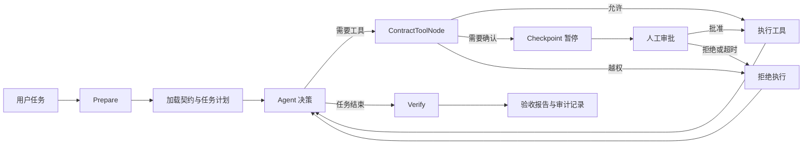

# PactFlow Agent 面试讲述稿

> 这份稿子根据当前仓库实现、测试和 Git 记录整理。文中的 V1 到 V4 是适合面试表达的设计演进线，不要求与每一个 commit 一一对应。
>
> 默认你能对仓库里的设计和代码负责。涉及个人分工、开发周期、线上用户量的内容，请按真实情况调整。

## 先记住一句话

PactFlow 是一个契约约束下的透明可控 Agent Runtime。它把 Agent 的工具调用放进统一治理流程，在执行前检查权限，在高风险动作前暂停审批，在执行后根据证据自动验收。

面试开场可以直接说下面这段。

> 我做的项目叫 PactFlow，早期名字是 CyberClaw。它是一个基于 LangGraph 和 LangChain 的 Agent Runtime。这个项目关注的重点是 Agent 获得文件、Shell 和动态 Skill 等能力以后，系统怎样知道它做了什么，怎样在执行前拦住越权动作，以及怎样用证据确认任务真的完成了。

说完就开始画图，不要继续念功能清单。

## 白板总图

先从左到右画下面这条主链。面试时不用画得很漂亮，方框和箭头足够。



画图时配一句话。

> 整个系统可以看成一条受管执行链。模型负责判断下一步做什么，运行时负责判断这一步能不能做，SQLite 和审计日志负责留下证据，最后的 Verify 节点负责验收。

## 第一阶段搭出可工作的 Agent

### 白板怎么画

```text
用户 -> LLM -> Tool -> LLM -> 回答
          |
          +-> 对话摘要和用户画像
```

### 你照着说

> 第一版先解决 Agent 能不能完整运行。我用 LangGraph 建了状态图，Agent 节点读取对话状态，让模型决定直接回答还是调用工具。工具执行后再回到 Agent 节点，直到模型给出最终回答。
>
> 工具层包含时间、计算、定时任务、用户画像、文件读写和受限 Shell。上下文较长时，系统按完整用户回合裁剪旧消息，把旧内容压缩成短期摘要，同时保留长期用户画像。这样已经具备一个本地个人 Agent 的基本形态。

这里可以顺手写出最早的循环。

```text
agent -> tools -> agent
```

接着主动讲出这一版的问题。

> 这时我碰到的主要问题是，模型知道安全要求，不代表运行时一定能执行这些要求。只把限制写进 Prompt，模型仍可能生成越权路径、危险 Shell，或者直接运行一个并不了解的 Skill。工具越来越多以后，风险入口也越来越多。

### 这一段想让面试官听到什么

- 你先完成了 Agent 基础运行循环
- 你理解模型决策和工具执行是两个责任边界
- 你发现 Prompt 只能影响模型行为，无法代替运行时强制校验

## 第二阶段加入契约和统一工具网关

### 白板怎么改

在 LLM 和 Tool 中间插入一个大方框。

```text
LLM -> ContractToolNode -> Tool
              |
              +-> allow
              +-> deny
              +-> require_confirmation
```

在旁边再写一份契约包含的内容。

```text
TaskContract
目标
可交付物
可读写路径
可执行命令
工具白名单与黑名单
资源风险边界
验收规则
```

### 你照着说

> 第二版我把控制点放到了工具执行入口。我定义了 Pydantic 契约模型，用 JSON 描述任务目标、交付物、允许读写的资源、允许执行的命令、工具策略和验收规则。契约先经过 Schema 校验和批准哈希校验，运行时只接受当前已经批准的版本。
>
> 所有 Agent 可见工具都进入同一个 ContractToolNode。内置工具、自定义工具和动态 Skill 不再各自判断权限。网关先把调用解析成能力和资源，再结合契约给出 allow、deny 或 require_confirmation。写入路径和 Shell 命令没有命中允许规则时按拒绝处理，cannot_write 和 cannot_execute 具有更高优先级。

给面试官一个具体例子。

> 比如契约允许写 reports 目录，同时禁止写 skills 目录。模型即使生成了 write_office_file 并把目标设成 skills 下的文件，调用也会在真正写盘前被 ContractToolNode 拒绝。这个控制点位于模型外部，因此更换模型或修改 Prompt 都不会绕开它。

### 为什么统一网关很重要

如果面试官追问架构价值，可以这样答。

> 统一网关解决了策略散落的问题。每加一种工具，只要声明 capability 和 resource 元数据，就能复用同一套契约判断、审批、限额、审计和证据记录。安全逻辑不用复制到每一个工具函数里。

### 这一版留下的问题

> 高风险动作需要人工确认以后，又出现了一个更细的问题。系统暂停后如果重新让模型生成工具调用，模型可能修改参数。用户看到并批准的是 A，恢复后实际执行的可能变成 B。审批还要防止重复使用、过期后继续执行，以及程序重启后丢失状态。

## 第三阶段做可恢复的一次性审批

### 白板怎么改

在 `require_confirmation` 后面画两份状态。

```text
原始调用
tool_call_id + 原始参数
        |
        v
LangGraph Checkpoint 暂停
        |
        v
SQLite 审批账本
action_id + 调用指纹 + 脱敏参数 + 状态 + 过期时间
        |
        v
consume_exact 一次消费
```

### 你照着说

> 第三版处理高风险调用的精确暂停和恢复。ContractToolNode 遇到 require_confirmation 时调用 LangGraph interrupt。Checkpoint 保存原始 tool_call_id 和参数，CLI 展示工具名、脱敏参数、风险级别、命中的契约条款和有效期。
>
> 审批记录写入 SQLite。用户批准后，系统会核对 action_id、thread_id、tool_call_id、工具名、参数指纹和 contract_hash。所有字段都匹配，审批状态也有效时，consume_exact 才会把它事务性地消费掉。随后系统直接执行检查点里的原始调用，不会再次请求模型生成参数。
>
> 拒绝和超时都不会执行工具。批准记录只能消费一次，无法重放。Checkpoint 和审批账本都持久化以后，程序退出再启动也可以恢复尚未完成的审批。

这一段可以用一句很容易让面试官记住的话收住。

> 用户批准的是哪一次调用，运行时就只允许恢复哪一次调用。

### 为什么分成 Checkpoint 和审批账本

> Checkpoint 负责恢复 Agent 图里的执行现场，审批账本负责权限状态和审计。两者分开以后，原始参数可以由状态机保存，账本只记录脱敏参数、指纹和批准状态。这样既能精确恢复，也能减少敏感信息进入审批记录。

## 第四阶段补齐任务生命周期和证据验收

### 白板怎么改

把最外层流程补完整。

```text
prepare -> agent/tools -> verify -> finalize
```

在下方写三个关键词。

```text
run_id
evidence
acceptance report
```

### 你照着说

> 有了执行权限控制以后，我继续处理任务完成标准。模型说完成了，只能说明模型准备结束当前对话。系统还需要判断文件是否真的生成，要求的工具是否调用，是否出现契约违规，以及高审计任务有没有未上报的文件变化。
>
> 现在每个用户请求都会创建独立 run_id，计划、工具调用、审批和证据都绑定在这一轮运行上。LangGraph 主流程扩展成 prepare、agent 和 tools 循环、verify、finalize。prepare 阶段加载契约和任务计划，verify 阶段根据运行证据生成验收报告，finalize 记录接受、拒绝或需要人工复核的结果。
>
> 系统提供 chat、development 和 audited 三种运行模式。development 可以让模型生成有依赖关系的任务 DAG，计划进入运行时前会校验任务数量、重复 ID 和依赖方向，失败时回退到确定性规划。audited 会在执行前记录文件基线，结束后做变更对账，发现越界变化或未上报变化时把结果标成需要复核。

给一个验收例子。

> 用户要求在 reports 下生成 summary.md。执行结束后，验收模块会检查 file_exists、tool_called 和 no_contract_violation 等规则。报告同时绑定 run_id 和 contract_hash，避免拿其他轮次的日志证明当前任务完成。

## 当前版本继续补上的两层治理

这两层不要在开场展开。面试官对安全或 Skill 体系感兴趣时再讲。

### 指令级安全治理

> 工具参数还可能受到前序工具结果影响。比如一个低可信搜索结果诱导 Agent 写文件或执行命令。为此我给每次工具调用构造指令信封，记录来源引用、可信度、机密级别和风险等级。低可信数据驱动写入、执行或外部动作时要求确认，机密数据流向外部工具时直接拒绝。observe 模式可以先记录策略命中，验证规则后再切换到 enforce。

### 渐进式 Skill 发现

> Skill 数量变多以后，把所有完整说明一次性塞进上下文会影响启动速度和 Token。当前实现启动时只扫描 Manifest 元数据，通过 discover_skills 缩小候选范围。低风险可信 Skill 可以直接进入运行，高风险 Skill 必须先查看完整 help。检索只负责找候选，最终执行权限仍由 ContractToolNode 和契约决定。

## 八分钟完整口述顺序

你可以按下面的时间练习。面试现场有人打断很正常，被追问时就进入对应细节。

### 第 0 到 40 秒

> 我做的是 PactFlow，一个基于 LangGraph 和 LangChain 的透明可控 Agent Runtime。它关注 Agent 获得文件、Shell 和动态 Skill 能力以后，如何在执行前限制边界，在高风险动作前完成人工审批，并在执行后根据证据验收结果。

### 第 40 秒到 1 分 30 秒

画最简单的 `用户 -> LLM -> Tool -> LLM`。

> 第一版完成了 Agent 工具循环、双水位记忆和本地工作区。运行以后我发现，只依赖 Prompt 约束风险很大。模型可能生成越权路径，也可能调用一个不了解的 Skill，所以必须在模型与工具之间增加独立的运行时控制点。

### 第 1 分 30 秒到 3 分钟

加入 `ContractToolNode` 和三种决策。

> 我定义了结构化 TaskContract，把目标、资源范围、工具策略、命令范围和验收条件写成可校验数据。所有工具统一经过 ContractToolNode。网关把调用解析成 capability 和 resource，再做 allow、deny 或 require_confirmation。这样限制由运行时代码执行，更换模型也不会失效。

### 第 3 分钟到 4 分 30 秒

画 Checkpoint 和 SQLite 审批账本。

> 高风险动作通过 LangGraph interrupt 原地暂停。Checkpoint 保存原始 tool_call_id 和参数，SQLite 保存调用指纹、契约哈希、状态和有效期。批准后通过 consume_exact 一次消费，只恢复这次原始调用。拒绝、超时和重复使用都不会执行，程序重启后也能继续处理未完成审批。

### 第 4 分 30 秒到 6 分钟

补上完整生命周期。

> 每次请求创建独立 run_id。prepare 阶段准备契约和计划，agent 与 tools 完成执行，verify 根据文件、工具、违规和审批证据生成报告，finalize 关闭任务。development 模式支持模型规划的任务 DAG，audited 模式还能做文件基线和变更对账。

### 第 6 分钟到 7 分钟

讲测试和数据。

> 当前本地完整回归是 132 项，覆盖路径逃逸、危险命令、审批参数绑定、审批重放、契约哈希篡改、重启恢复、规划器校验和文件变更对账。仓库还记录了一组 20 个场景的两阶段 Skill 对照实验。安全命中率从 50% 提升到 90%，P0 事故率从 50% 降到 10%，平均决策耗时从 19.33 秒增加到 23.88 秒。这组数据说明安全收益伴随着约 23.5% 的时延开销，它是本地实验结果，不能当作生产环境指标。

### 第 7 分钟到 8 分钟

讲取舍和下一步。

> 这个项目当前的取舍很明确。强约束提高了可控性，也增加了契约维护、审批交互和运行时复杂度。下一步我会继续做策略版本迁移、更系统的评测集，以及把不同工具的副作用级别做得更细。现阶段我认为项目最有价值的部分是把 Agent 的模型决策、权限判断和结果验收拆成了可以独立测试的组件。

## 两分钟精简版

> PactFlow 是一个契约约束下的 Agent Runtime。普通 Agent 的主链是模型选择工具、工具返回结果、模型继续推理。它的问题在于，权限往往依赖 Prompt，执行完成也缺少可验证标准。
>
> 我在模型和所有工具之间增加了统一的 ContractToolNode。任务契约用 Pydantic 和 JSON 描述可读写路径、可执行命令、工具范围、风险边界和验收规则。工具调用会得到允许、拒绝或需要确认三种结果。
>
> 高风险调用通过 LangGraph Checkpoint 原地暂停，审批写入 SQLite，并绑定 tool_call_id、参数指纹和 contract_hash。批准后只恢复原始调用，而且只能消费一次。任务结束时，系统按 run_id 汇总证据，生成绑定契约版本的验收报告。
>
> 当前回归测试 132 项。项目还支持任务 DAG、文件基线对账、指令来源和可信度传播，以及按风险分级的 Skill 发现。我的重点是把 Agent 的安全从提示词要求推进到可执行、可审计、可验收的运行时机制。

## 演示时怎么操作

面试前准备好 active contract，并完成契约批准。现场只演示三条路径，总时长控制在两到三分钟。

### 第一步展示允许动作

输入下面的任务。

```text
请在 office 的 reports/summary.md 写入一段 Demo 总结。
```

你要解释。

> reports 命中 can_write，所以工具可以执行。结束后验收报告会检查文件存在和无契约违规。

### 第二步展示高风险审批

让 Agent 执行契约中需要人工确认的 Shell 命令。审批面板出现后指出工具名、参数、风险级别、条款和有效期，再输入 `Y`。

你要解释。

> 这里恢复的是刚才暂停的同一个 tool_call_id 和原始参数，模型不会重新生成调用。审批消费以后不能再次使用。

### 第三步展示越权拒绝

输入下面的任务。

```text
请在 office 的 skills/evil.py 写入一个测试脚本。
```

你要解释。

> skills 命中禁止写入范围，ContractToolNode 会在工具执行前拒绝，并把 violation 写入运行证据，最终验收不会通过。

## 高频追问和回答

### 为什么不用 System Prompt 限制工具

> Prompt 仍然保留，它适合告诉模型怎样规划和选择工具。权限判断由模型外的运行时完成。这样即使模型忽略提示、遭遇提示注入或更换模型，写入路径、命令和工具边界仍由确定性代码执行。

### 为什么选择 LangGraph

> 这个项目需要明确的 Agent 循环、持久化状态和人工审批暂停。LangGraph 的状态图适合表达 prepare、agent、tools、verify 这些节点，interrupt 和 checkpointer 也能保存工具调用现场。普通链式调用在中断恢复和运行生命周期上需要补更多基础设施。

### 为什么契约使用 JSON 和 Pydantic

> JSON 方便存储、审计和版本化，Pydantic 负责字段类型、枚举和额外字段校验。策略进入运行时前先完成结构校验，减少临时字典带来的歧义。契约批准还绑定内容哈希，文件被修改后原批准自动失效。

### ContractToolNode 会不会成为瓶颈

> 它会增加策略检查和审计开销，但这些工作大多是本地规则判断和 SQLite 写入，通常小于一次模型调用。统一网关也便于测量耗时和做缓存。主要需要关注的是审批带来的人机等待，因此低风险可信操作可以直接允许，高风险动作再进入确认。

### 怎样防止批准以后参数被替换

> Checkpoint 保存原始调用，账本保存参数指纹。恢复时会同时核对 action_id、thread_id、tool_call_id、工具名、参数和 contract_hash。任何一项变化都会拒绝消费审批。

### 怎样防止审批重放

> 审批有 pending、approved、rejected、expired 和 consumed 等状态。consume_exact 在 SQLite 事务中完成状态检查和一次性更新。成功执行前必须把 approved 转为 consumed，第二次使用同一 action_id 会失败。

### 没有 active contract 时怎么办

> 普通读取和纯计算可以保持兼容。涉及写入、执行、外部动作和高风险能力时进入受管或确认路径。这样保留日常聊天体验，同时避免无契约情况下静默执行高风险操作。

### 为什么还需要工具本身的沙盒

> 契约控制任务允许做什么，工具沙盒控制底层操作怎样安全执行。路径规范化、防目录逃逸、危险命令拦截、超时和敏感环境清理都属于最后一道执行保护。两层同时存在可以降低单点判断失误的影响。

### Skill 为什么分 manifest、help 和 run

> manifest 提供轻量能力卡，用来筛选候选 Skill。help 读取完整说明，高风险 Skill 必须经过这一步。run 才会执行。分阶段以后，Agent 可以在看到限制后更换工具，也能避免启动时加载全部 Skill 内容。

### 为什么检索到 Skill 以后还要再做权限校验

> 检索只回答哪个 Skill 可能有用，契约回答当前任务能否执行它。相关性和权限是两件事。候选 Skill 仍然要经过风险门槛和 ContractToolNode。

### 如何判断任务真的完成

> 每轮请求有独立 run_id。工具成功、失败、拒绝、审批和文件变化都会进入运行证据。verify 根据契约里的 file_exists、tool_called、tool_not_called 和 no_contract_violation 等规则生成报告。高审计模式还会对比执行前后的文件快照。

### 项目最大的不足是什么

> 当前策略仍以本地文件、Shell 和 Skill 为主，真实企业环境还需要接入身份系统、远程资源权限和集中策略发布。现有评测主要是本地回归和有限场景对照，外部有效性还需要更大规模、可复现的数据集。审批过多也会影响体验，因此风险分级和策略调优仍然重要。

### 如果让你重做一次会改什么

> 我会更早定义统一的工具元数据和运行事件模型，让 capability、resource、risk 和 evidence 从第一版就贯穿工具层。这样后面的契约、审批和验收可以更早共享一套数据结构，减少兼容代码。

## 面试时不要这样讲

- 不要从记忆、心跳、天气和计算器开始逐项报功能
- 不要只说用了 LangChain、LangGraph、SQLite，要解释各自解决了什么问题
- 不要把本地 20 场景数据说成线上生产指标
- 不要声称完全解决了提示注入或 Agent 安全
- 不要把所有代码都说成个人完成，团队项目按实际分工表达
- 不要一次讲完全部细节，先沿主图推进，等面试官追问再展开

## 面试前检查清单

- 能在 30 秒内讲清项目定位
- 能闭眼画出 `prepare -> agent/tools -> verify -> finalize`
- 能解释 ContractToolNode 的三种决策
- 能解释 Checkpoint 和审批账本的职责区别
- 能解释审批怎样绑定精确参数并防止重放
- 能举出一个允许、一个确认、一个拒绝的例子
- 能准确说出 132 项回归测试和本地对照实验的边界
- 能承认当前限制并给出合理下一步
- 能把个人负责部分替换成真实表述

## 代码位置速查

面试前自己再过一遍这些文件，防止追问落到代码时只能讲概念。

| 内容 | 文件 |
| --- | --- |
| LangGraph 主流程 | `pactflow/core/agent.py` |
| 统一工具治理与审批中断 | `pactflow/core/contracts/tool_node.py` |
| 契约数据模型 | `pactflow/core/contracts/models.py` |
| 契约策略判断 | `pactflow/core/contracts/policy.py` |
| 指令来源与安全标签 | `pactflow/core/contracts/instructions.py` |
| 指令级安全策略 | `pactflow/core/contracts/security_policy.py` |
| 任务生命周期与验收 | `pactflow/core/process/manager.py` |
| 模型规划与确定性回退 | `pactflow/core/process/task_planner.py` |
| SQLite 运行账本 | `pactflow/core/runtime_store.py` |
| Skill 发现和懒加载 | `pactflow/core/skill_loader.py` |
| 文件和 Shell 沙盒 | `pactflow/core/tools/sandbox_tools.py` |
| 端到端流程测试 | `tests/test_e2e_process_flow.py` |
| P0 回归测试 | `tests/test_p0_regression.py` |

最后收尾时只说一句。

> 这个项目让我完整处理了一次 Agent 从能调用工具，到能在明确边界内执行并留下可验收证据的过程。
